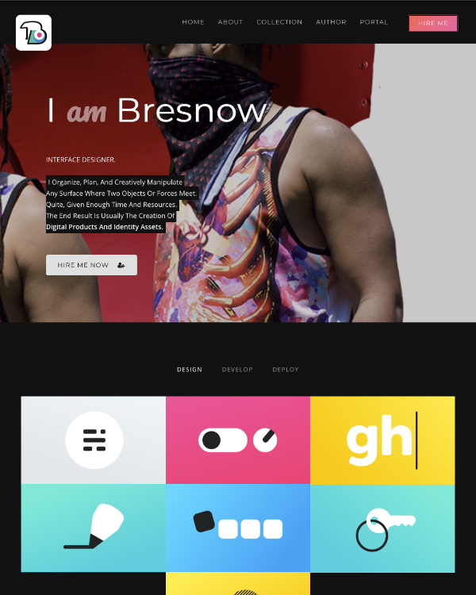

# Bresnow Design Ghost Theme

A starter framework for Ghost themes! Fork this repository and start your development here with all the main things you need to develop a custom Ghost theme.
&nbsp;


## First time using a Ghost theme?

Ghost uses a simple templating language called [Handlebars](http://handlebarsjs.com/) for its themes.

We've documented our default theme pretty heavily so that it should be fairly easy to work out what's going on just by reading the code and the comments. Once you feel comfortable with how everything works, we also have full [theme API documentation](https://themes.ghost.org) which explains every possible Handlebars helper and template.

## Development

Styles are compiled using Gulp/PostCSS to polyfill future CSS spec. You'll need [Node](https://nodejs.org/), [Yarn](https://yarnpkg.com/) and [Gulp](https://gulpjs.com) installed globally. After that, from the theme's root directory:

```bash
# Install
yarn

# Run build & watch for changes
yarn dev
```

Now you can edit `/assets/css/` files, which will be compiled to `/assets/built/` automatically.

The `zip` Gulp task packages the theme files into `dist/<theme-name>.zip`, which you can then upload to your site.

```bash
yarn zip
```

&nbsp;

## PostCSS Features Used

- Autoprefixer - Don't worry about writing browser prefixes of any kind, it's all done automatically with support for the latest 2 major versions of every browser.
- [Color Mod](https://github.com/jonathantneal/postcss-color-mod-function)

&nbsp;

## Copyright & License

Copyright (c) 2021 Bresnow Design Studio - Released under the [MIT license](LICENSE).
